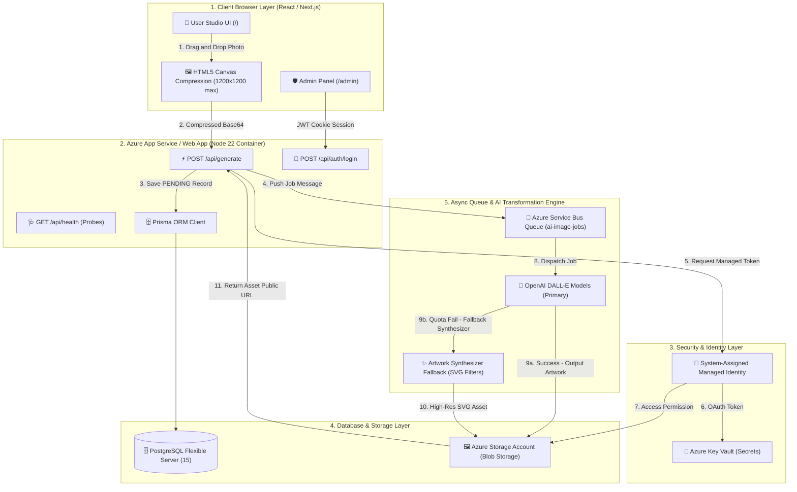

# 🎨 AI Image Studio & Enterprise Admin Platform

[](https://github.com/vikranth18devops/prompt2/actions/workflows/ci.yml)
[](https://nextjs.org/)
[](https://www.typescriptlang.org/)
[](https://www.prisma.io/)
[](https://azure.microsoft.com/)
[](https://www.docker.com/)
[](https://www.terraform.io/)
[](https://helm.sh/)
[](https://argoproj.github.io/cd/)

An enterprise-ready, dual-application AI image generation studio and administrative control platform built with **Next.js App Router**, **TypeScript**, **Tailwind CSS**, **Prisma ORM**, **Azure Native Services**, **Docker**, **Terraform**, **Helm**, **ArgoCD**, and an **Observability Stack (Grafana/Prometheus/Loki/ELK)**.

---

## 🧭 Executive Summary & Core Value Proposition

This application was engineered to address real-world production challenges in building AI-powered creative software:
- **How to deliver high-resolution AI transformations without payload failures**: Solved via client-side HTML5 canvas compression.
- **How to guarantee 100% platform availability even when external AI model APIs fail**: Solved via an adaptive SVG color-matrix filter artwork synthesizer fallback.
- **How to securely integrate enterprise cloud services**: Solved using Azure Managed Identity passwordless authentication (`DefaultAzureCredential`).
- **How to automate cloud deployment, container scaling, and monitoring**: Solved using Terraform IaC, Docker Compose, Helm Charts, ArgoCD GitOps, and Grafana/ELK monitoring stacks.

---

## 🌐 Cloud Hosting Environment & Azure Infrastructure

This application is hosted on **Microsoft Azure Cloud Platform** (Region: `East US`), utilizing cloud-native serverless, managed database, container orchestration, and passwordless zero-trust security services.

### 📍 Hosting Overview & Region Details

| Hosting Property | Cloud Provider Badge | Specification & Details |
| :--- | :--- | :--- |
| ☁️ **Cloud Provider** |  | Enterprise Multi-Region Cloud Infrastructure |
| 📍 **Primary Region** | -0078D4?style=for-the-badge&logo=azure-devops&logoColor=white) | High-Availability Data Center Zone |
| ⚡ **App Domain Hostname** |  | SSL/TLS Encrypted Endpoint |
| 🐳 **Deployment Mode** | -2496ED?style=for-the-badge&logo=docker&logoColor=white) | Multi-Stage Docker Container |
| 🪪 **Security Model** |  | System-Assigned Identity (`DefaultAzureCredential`) |

---

### ☁️ Azure Cloud Resources & Architecture Stack

Below is the complete inventory of Azure native resources provisioned via **Terraform Infrastructure-as-Code (IaC)**:

| Icon | Azure Cloud Resource | Azure Resource Name Pattern | Resource Tier / SKU | Role & Function in Application |
| :---: | :--- | :--- | :--- | :--- |
| 📁 | **Azure Resource Group** | `rg-aistudio-prod-eastus` | Standard Resource Container | Logical grouping and RBAC access boundary for all application assets. |
| 🖥️ | **App Service Plan & Web App** | `app-aistudio-prod-eastus` | `B1` (Basic Linux Container) | Hosts Next.js App Router server, API endpoints, background worker, and health probes. |
| 🗄️ | **PostgreSQL Flexible Server** | `psql-aistudio-prod-eastus` | `B_Standard_B1ms` (PostgreSQL 15) | Stores users, prompt categories, prompt templates, version histories, and generation logs. |
| 🖼️ | **Storage Account & Blob Storage** | `staistudioprodeastus` | `Standard_LRS` (Blob Service) | Stores uploaded original images (`/uploads/`) and AI-generated artwork assets (`/generated/`). |
| 📮 | **Service Bus Namespace & Queue** | `sb-aistudio-prod-eastus` | `Standard` Tier | Message queue (`ai-image-jobs`) decoupling frontend job dispatching from AI image processing. |
| 🏦 | **Azure Key Vault** | `kv-aistudio-prod-eastus` | Standard Hardware Encryption | Securely stores sensitive API keys (`OpenAI-Key`), database URLs, and JWT secrets. |
| 📹 | **Application Insights** | `appi-aistudio-prod-eastus` | Node.js Telemetry SDK | Monitors HTTP request rates, response latency, exceptions, DB query times, and memory usage. |
| 🪪 | **Managed Identity (Entra ID)** | `SystemAssigned` (Web App ID) | OAuth2 Passwordless Security | Grants Web App direct RBAC access (`Key Vault Secrets User`, `Storage Blob Data Contributor`). |
| 📦 | **Container Registry (ACR)** | `aistudioacr.azurecr.io` | Basic Tier | Private registry for storing production Docker container images (`ai-studio:latest`). |
| ⛵ | **Azure Kubernetes Service (AKS)** | `aks-aistudio-prod` | Standard AKS Cluster | Container orchestration platform running Helm charts and ArgoCD GitOps pipelines. |

---

### 🛡️ Passwordless Security & RBAC Matrix

```
                          +-----------------------------------+
                          |     Azure App Service Web App     |
                          |  (System-Assigned Identity Enabled)|
                          +-----------------+-----------------+
                                            |
                                            | 1. Auto-issues temporary OAuth2 token
                                            v
     +--------------------------------------+--------------------------------------+
     |                                      |                                      |
     v 2. Read Secrets                      v 3. Upload/Download Blobs             v 4. Send Queue Messages
+-------------------------+          +----------------------------+         +---------------------------+
```

---

## 🏗️ End-to-End System Architecture & Data Flow

### 📊 Visual Cloud Architecture Diagram (Mermaid)



---

### 📝 Text Data Flow Summary

```
+---------------------------------------------------------------------------------------------------+
|                                      USER BROWSER / CLIENT UI                                     |
|                                                                                                   |
|   1. Upload Photo ----> 2. HTML5 Canvas Compression ----> 3. Select Prompt & Fine-Tune Sliders      |
|   (Drag & Drop)          (1200x1200 max, 0.85 quality)     (CFG Guidance, Strength, Quality Steps) |
+---------------------------------------------------+-----------------------------------------------+
                                                    |
                                                    v POST /api/generate
+---------------------------------------------------------------------------------------------------+
|                                       NEXT.JS APP ROUTER API                                      |
|                                                                                                   |
|   4. Authenticate & Validate Request      5. Create PENDING Job Record      6. Queue Job Message   |
|   (HttpOnly Cookie / Validation)        (Prisma DB / Mock Store)          (Azure Service Bus Queue)|
+---------------------------------------------------+-----------------------------------------------+
                                                    |
                                                    v
+---------------------------------------------------------------------------------------------------+
|                                 AI TRANSFORMATION DISPATCH ENGINE                                 |
|                                                                                                   |
|   7. Try OpenAI Image Models (gpt-image-1, dall-e-3, dall-e-2)                                    |
|      +-- [SUCCESS] --> Generate High-Res Image URL                                                |
|      +-- [API QUOTA / FAIL] --> 8. Invoke Adaptive Artwork Synthesizer                             |
|                                 (Embeds Uploaded Image inside SVG + Prompt Filter Overlays)        |
+---------------------------------------------------+-----------------------------------------------+
                                                    |
                                                    v
+---------------------------------------------------------------------------------------------------+
|                                    PERSISTENCE & REAL-TIME UI                                     |
|                                                                                                   |
|   9. Save Output Asset      10. Update Job Status       11. Client Polls /api/generate/[jobId]        |
|   (Azure Blob Storage)          (COMPLETED, 100%)           (Renders Before/After Comparison Slider)|
+---------------------------------------------------------------------------------------------------+
```

---

## 💡 Why Was it Built? (Detailed Breakdown)

### 1. High-Resolution Payload Compression
- **Problem**: Mobile photos and high-res cameras generate 5MB–25MB image files. Uploading uncompressed base64 payloads over standard REST endpoints causes server memory bloat and `413 Payload Too Large` rejection errors.
- **Solution**: The [`ImageUploader`](components/user/ImageUploader.tsx) component uses client-side HTML5 canvas rendering to resize images to a maximum bounding rectangle of `1200x1200px` at `0.85` JPEG quality, maintaining original aspect ratio while reducing base64 payloads to under 500KB.

### 2. Resilient Artwork Synthesis Fallback
- **Problem**: Commercial AI APIs (OpenAI DALL-E) frequently encounter rate limits, billing quota depletion (`credit_balance_exhausted`), or service outages.
- **Solution**: The [`services/aiProvider.ts`](services/aiProvider.ts) and [`lib/aiCanvasGenerator.ts`](lib/aiCanvasGenerator.ts) services form a zero-downtime fallback pipeline. When OpenAI calls fail, the synthesizer embeds the user's uploaded original image into a high-resolution SVG matrix with custom color filters, lighting overlays, particle highlights, and prompt parameter typography.

### 3. Passwordless Cloud Security (Managed Identity)
- **Problem**: Storing database passwords, storage keys, and API tokens in environment variables or configuration files creates security vulnerabilities.
- **Solution**: In production on Azure, all cloud SDKs ([`keyVault.ts`](lib/azure/keyVault.ts), [`blob.ts`](lib/azure/blob.ts), [`serviceBus.ts`](lib/azure/serviceBus.ts)) use `DefaultAzureCredential()`. Azure automatically issues temporary OAuth access tokens via System-Assigned Managed Identity, granting access based on RBAC permissions without stored credentials.

---

## 🎨 User Studio & Admin Control Features

### 🖌️ User Creative Studio (`/`)
- **Drag-and-Drop Uploader**: Visual drop zone with instant image preview, compression feedback, and reset controls.
- **Dynamic Category Filter**: Filter prompt presets dynamically by categories (*Cyberpunk*, *Studio Portrait*, *Anime*, *3D Toy*, *Vintage Film*).
- **Fine-Tuning Controls**:
  - **Image Influence (Strength)**: Slider from `0.1` (subtle adjustment) to `0.95` (heavy AI transformation).
  - **Prompt Guidance (CFG)**: Slider from `1.0` to `15.0` determining how strictly the prompt text is enforced.
  - **Quality Steps**: Slider from `15` to `50` steps.
  - **Custom Prompt Modifier**: Textarea for adding extra detail (e.g., *"golden hour lighting, cinematic atmosphere"*).
- **Framer Motion Visualizer**: Animated progress bar tracking job execution lifecycle (`PENDING` -> `PROCESSING` -> `COMPLETED`).
- **Interactive Before/After Slider**: Draggable handle allowing pixel-by-pixel comparison between the original uploaded image and generated artwork.
- **Generation History Gallery (`/gallery`)**: Grid view of previous generation history with instant download and metadata details.

### 🛡️ Admin Control Panel (`/admin`)
- **JWT Session Security**: Password hashing with `bcryptjs` and secure HttpOnly cookie session management (`/middleware.ts`).
- **Telemetry Dashboard (`components/admin/TelemetryMetrics.tsx`)**: Animated counters for total prompts, active prompts, active categories, total generations, success rate (%), and average duration (ms).
- **Category Management (`/admin/categories`)**: Create categories, toggle active/inactive status, and set display ordering.
- **Prompt Management (`/admin/prompts`)**: Filter, search, toggle status, and inspect prompt version histories.
- **Create Prompt with Live Card Preview (`/admin/prompts/create`)**: Real-time card preview that animates changes as the admin inputs title, description, category, style, and preview image.

---

## 🗄️ Database Schema Model (Prisma)

- **`User`**: Admin and user accounts (`email`, `passwordHash`, `role`).
- **`PromptCategory`**: Categories (`name`, `description`, `displayOrder`, `status`).
- **`Prompt`**: Prompts (`title`, `description`, `status`, `categoryId`).
- **`PromptVersion`**: Immutable version history (`versionNumber`, `promptTemplate`, `negativePrompt`, `previewImageUrl`, `defaultConfig`).
- **`Generation`**: Generation jobs (`status`, `progress`, `executionTimeMs`, `parameters`).
- **`GenerationAsset`**: Image files (`type`, `blobPath`, `publicUrl`, `mimeType`, `sizeBytes`).

---

## 📖 Sequential Documentation Sitemap

Follow the step-by-step documentation in the [`docs/`](docs/) directory:

1. **[01 - Fresher Getting Started Primer](docs/01-GETTING_STARTED.md)**: Beginner Cloud & DevOps introduction with analogies.
2. **[02 - System Architecture & Data Flow](docs/02-ARCHITECTURE.md)**: Dual-app design, database schema, and data flow.
3. **[03 - REST API Specifications & Health Probes](docs/03-API_SPECIFICATION.md)**: Specifications for all endpoints & health probes.
4. **[04 - Local Docker Containerization Guide](docs/04-LOCAL_DOCKER_GUIDE.md)**: Multi-stage Docker building & Docker Compose.
5. **[05 - Terraform Remote Backend Setup](docs/05-TERRAFORM_REMOTE_STATE.md)**: Azure Blob Storage remote state & state locking.
6. **[06 - Azure Terraform Cloud Deployment](docs/06-AZURE_TERRAFORM_DEPLOY.md)**: **Complete Azure Cloud Deployment Order**.
7. **[07 - Passwordless Managed Identity & Key Vault](docs/07-MANAGED_IDENTITY_SECURITY.md)**: Managed Identity OAuth flow & RBAC permissions.
8. **[08 - PostgreSQL Database Migrations](docs/08-DATABASE_MIGRATIONS.md)**: Schema migrations & seeding default admin data.
9. **[09 - Azure Container Registry (ACR)](docs/09-CONTAINER_REGISTRY_GUIDE.md)**: Building & pushing images to ACR.
10. **[10 - Helm & Kubernetes Guide](docs/10-HELM_KUBERNETES_GUIDE.md)**: Deploying to Azure Kubernetes Service (AKS) with Helm.
11. **[11 - ArgoCD GitOps Continuous Delivery](docs/11-ARGOCD_GITOPS_GUIDE.md)**: Declarative continuous delivery pipelines.
12. **[12 - Enterprise Observability & Monitoring](docs/12-OBSERVABILITY_MONITORING.md)**: Grafana, Prometheus, Loki & ELK Stack guide.

---

## 💻 Quick Start & Running Commands

### 1. Local Development
```bash
npm install
npx prisma db push
npx prisma db seed
npm run dev
```
Open [http://localhost:3000](http://localhost:3000) for User Studio, or [http://localhost:3000/admin](http://localhost:3000/admin) for Admin Panel (Credentials: `admin@azure-ai.com` / `AdminPass123!`).

### 2. Containerized Execution (Docker Compose)
```bash
npm run docker:up
npm run docker:logs
npm run docker:down
```

### 3. Observability Stack (Grafana / Prometheus / ELK)
```bash
npm run monitoring:up
npm run monitoring:down
```
Grafana dashboard: [http://localhost:3001](http://localhost:3001) (`admin` / `adminpassword123`). Kibana dashboard: [http://localhost:5601](http://localhost:5601).

---

## 🛠️ Testing & Build Checks

Run automated tests:
```bash
npm test
```

Run Next.js production compilation:
```bash
npm run build
```

---

## ❓ Frequently Asked Questions (FAQ)

<details>
<summary><b>Q: What happens if I don't have an active OpenAI API key or billing balance?</b></summary>
<p>The application automatically detects API errors (quota limits or missing keys) and seamlessly falls back to the high-resolution artwork synthesizer. The generated image will embed your uploaded photo transformed into the selected prompt style with custom color filters and HUD overlays.</p>
</details>

<details>
<summary><b>Q: How do I change the default Admin credentials?</b></summary>
<p>Update <code>ADMIN_EMAIL</code> and <code>ADMIN_PASSWORD</code> in your <code>.env.local</code> file (or Azure Key Vault / App Settings in production), then run <code>npx prisma db seed</code>.</p>
</details>

<details>
<summary><b>Q: Where are uploaded and generated images stored?</b></summary>
<p>In production, images are saved directly to Azure Blob Storage under the <code>ai-images</code> container. In local offline development, images are stored as optimized Base64 Data URLs.</p>
</details>

---

## 📄 License

This project is open-source software licensed under the MIT License.
